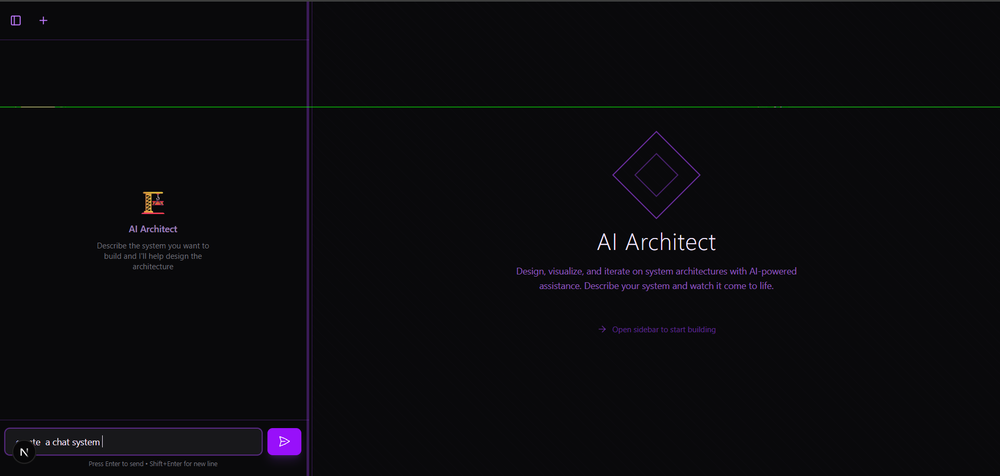
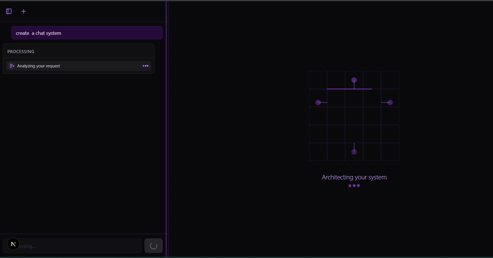
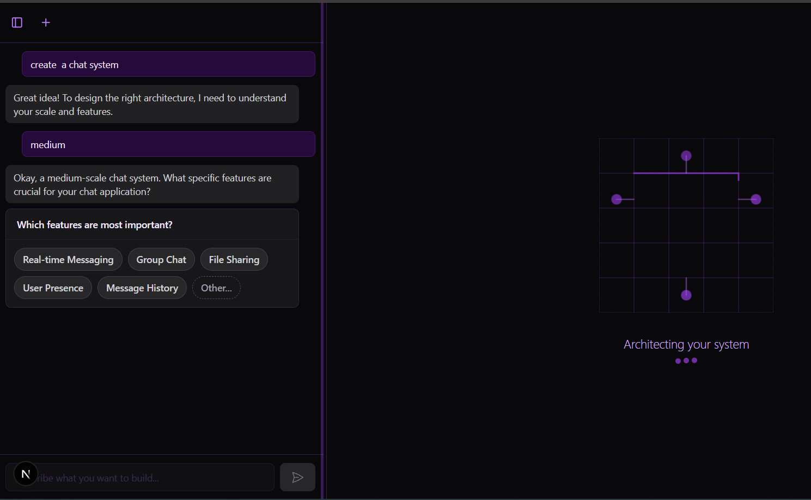
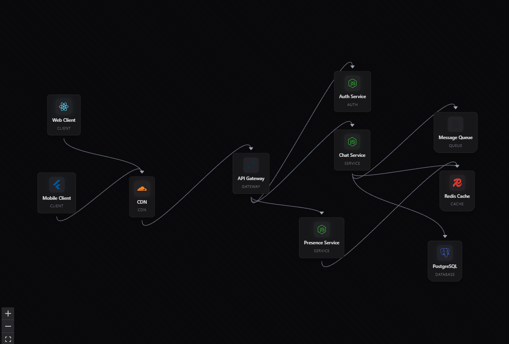
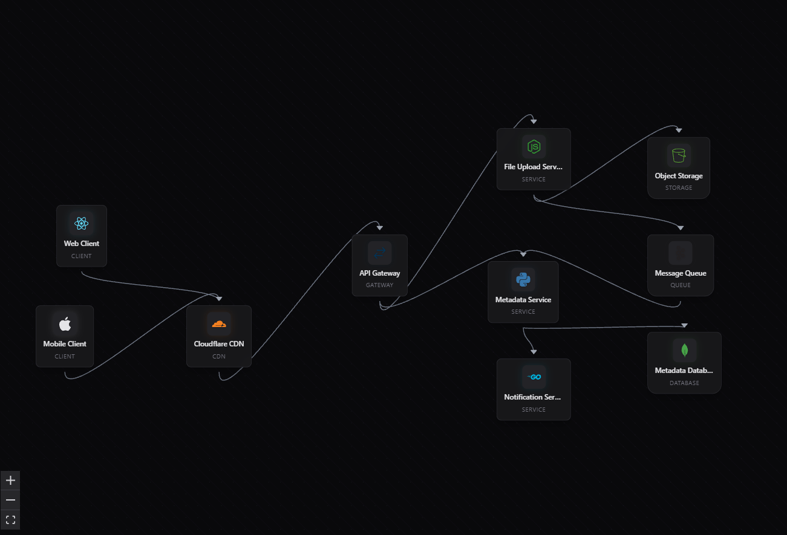

# 🏗️ AI Architect

An intelligent system design assistant powered by a multi-agent architecture. Describe what you want to build, and AI Architect will guide you through requirements gathering, technology research, and generate a visual architecture diagram.



## ✨ Features

- **Conversational Design Flow** — Natural language interaction to understand your requirements
- **Smart Clarifying Questions** — Quick-select options to efficiently gather system specifications
- **Live Technology Research** — Real-time research comparing technology options with pros/cons
- **Auto-Generated Architecture** — Visual system diagrams with proper component relationships
- **Interactive Canvas** — Draggable nodes with technology-specific icons and styling

## 🤖 Multi-Agent Architecture

AI Architect uses three specialized agents working together:

| Agent | Role |
|-------|------|
| **Orchestrating Agent** | Coordinates the conversation, asks clarifying questions, and decides when to trigger research or design |
| **Research Agent** | Searches and compares technology options using Exa, providing citations and recommendations |
| **Design Agent** | Generates architecture diagrams based on gathered requirements and decisions |

## 📸 How It Works

### 1. Start a Conversation

Describe the system you want to build. The orchestrating agent analyzes your request and begins gathering requirements.



### 2. Answer Clarifying Questions

The agent asks targeted questions about scale, features, and preferences using quick-select options for fast responses.



### 3. Technology Research

When critical technology decisions arise, the Research Agent searches for the best options, presenting pros, cons, and recommendations with source citations.



### 4. Architecture Generation

Once enough information is gathered, the Design Agent creates a comprehensive architecture diagram on the interactive canvas.



## 🛠️ Tech Stack

- **Framework:** Next.js 16 (App Router)
- **UI:** React, Tailwind CSS, Framer Motion
- **Canvas:** React Flow (@xyflow/react)
- **AI:** AI SDK with Gemini 2.0 Flash
- **Research:** Exa API
- **Validation:** Zod schemas

## 🚀 Getting Started

### Prerequisites

- Node.js 18+ or Bun
- AI Gateway API key
- Exa API key

### Installation

```bash
# Clone the repository
git clone https://github.com/yourusername/ai-architect.git
cd ai-architect

# Install dependencies
npm install
# or
bun install
```

### Environment Setup

Create a `.env.local` file:

```env
AI_GATEWAY_API_KEY=your_ai_gateway_key
EXA_API_KEY=your_exa_api_key
```

### Run Development Server

```bash
npm run dev
# or
bun dev
```

Open [http://localhost:3000](http://localhost:3000) to start designing.

## 📁 Project Structure

```
ai-architect/
├── app/
│   ├── api/
│   │   ├── chat/          # Main chat endpoint (orchestrator)
│   │   └── research/      # Research polling endpoint
│   └── page.tsx           # Main application page
├── components/
│   ├── canvas/            # React Flow canvas components
│   ├── nodes/             # Custom architecture node components
│   └── sidebar/           # Chat interface components
├── hooks/                 # React hooks for state management
└── lib/
    ├── agents/            # Agent implementations
    │   ├── orchestrating-agent.ts
    │   ├── design-agent.ts
    │   └── research-agent.ts
    └── schemas/           # Zod validation schemas
```

## 🔄 Conversation Flow

```
User Input
    │
    ▼
┌─────────────────────┐
│ Orchestrating Agent │ ◄──── Analyzes & Coordinates
└─────────────────────┘
    │
    ├── mode: "clarify"  ──► Ask clarifying question
    │
    ├── mode: "research" ──► ┌────────────────┐
    │                        │ Research Agent │ ──► Compare technologies
    │                        └────────────────┘
    │
    └── mode: "design"   ──► ┌──────────────┐
                             │ Design Agent │ ──► Generate architecture
                             └──────────────┘
                                    │
                                    ▼
                            Canvas Visualization
```

## 📄 License

MIT

---

Built with ❤️ by [sundaram2021](https://github.com/sundaram2021)
